# LLMSelect - Visual Roadmap 🗺️

**Project Timeline:** 11-16 weeks total | **Current Phase:** 1 Complete ✅

---

## 📅 Timeline Overview

```
Phase 1: Foundation       ████████████████████ [COMPLETE ✅] Weeks 1-5
Phase 2: Comparison UI    ░░░░░░░░░░░░         [NEXT 🚀]    Weeks 6-8
Phase 3: Frontend Refactor░░░░░░░░             [PLANNED]    Weeks 9-10
Phase 4: Testing          ░░░░░░░░             [PLANNED]    Weeks 11-12
Phase 5: Conv. Management ░░░░                 [PLANNED]    Week 13
Phase 6: Performance      ░░░░                 [PLANNED]    Week 14
Phase 7: UX Polish        ░░░░                 [PLANNED]    Weeks 15-16
```

**Progress:** ███████░░░░░░░░░░░░░░░░░░░ 30%

---

## 🎯 Sprint Plan (Agile 2-Week Sprints)

### 🏁 Sprint 0: Foundation ✅ COMPLETE
**Weeks 1-5** | **Status:** Shipped to production

**Delivered:**
- ✅ User authentication (JWT + CSRF)
- ✅ API key encryption
- ✅ Backend refactor (service layer)
- ✅ Database models
- ✅ Error handling & logging
- ✅ Rate limiting
- ✅ API versioning

**Outcome:** Production-ready backend infrastructure

---

### 🚀 Sprint 1: Comparison Core
**Weeks 6-7** | **Status:** NEXT SPRINT 🎯

**Goals:**
- [ ] Implement comparison mode UI
- [ ] Multi-model selector component
- [ ] Side-by-side response layout
- [ ] Persist comparison results
- [ ] Add response metadata display

**Story Points:** 21  
**Priority:** 🔴 CRITICAL  
**Team Capacity:** 40 hours/week

**User Stories:**
1. As a user, I want to compare responses from multiple LLMs side-by-side
2. As a user, I want to select 2-4 models to compare
3. As a user, I want to see response time and token count for each model
4. As a user, I want to copy individual responses
5. As a user, I want to vote on which response I prefer

**Definition of Done:**
- [ ] Users can select multiple models
- [ ] Comparison results display side-by-side
- [ ] Results persist to database
- [ ] Response metadata shows correctly
- [ ] Unit tests pass
- [ ] Code review approved

---

### ⚡ Sprint 2: Streaming
**Week 8** | **Status:** PLANNED

**Goals:**
- [ ] Implement SSE backend endpoint
- [ ] Add streaming for all providers
- [ ] EventSource frontend integration
- [ ] Request cancellation support
- [ ] Streaming for comparison mode

**Story Points:** 13  
**Priority:** 🔴 CRITICAL

**User Stories:**
1. As a user, I want to see responses appear immediately (not wait 30+ seconds)
2. As a user, I want to cancel long-running requests
3. As a user, I want streaming to work in comparison mode

**Definition of Done:**
- [ ] Time to first token < 1 second
- [ ] Streaming works for all 4 providers
- [ ] Can cancel requests mid-stream
- [ ] No memory leaks
- [ ] Performance tests pass

---

### 🏗️ Sprint 3: Frontend Architecture
**Weeks 9-10** | **Status:** PLANNED

**Goals:**
- [ ] Extract custom hooks
- [ ] Implement Context API
- [ ] Add markdown rendering
- [ ] Add syntax highlighting
- [ ] Refactor large components

**Story Points:** 21  
**Priority:** 🟠 HIGH

**User Stories:**
1. As a developer, I want clean, maintainable code
2. As a user, I want to see formatted code with syntax highlighting
3. As a user, I want markdown rendering for lists, tables, etc.
4. As a user, I want to copy code blocks easily

**Definition of Done:**
- [ ] App.js < 150 lines
- [ ] All hooks extracted and tested
- [ ] Markdown renders correctly
- [ ] Code has syntax highlighting
- [ ] Components are < 200 lines each

---

### 🧪 Sprint 4: Testing
**Weeks 11-12** | **Status:** PLANNED

**Goals:**
- [ ] Add frontend test infrastructure
- [ ] Write component tests
- [ ] Write hook tests
- [ ] Expand backend coverage
- [ ] Add E2E tests

**Story Points:** 21  
**Priority:** 🟠 HIGH

**User Stories:**
1. As a developer, I want confidence that my code works
2. As a team, we want automated regression testing
3. As a product owner, I want quality metrics

**Definition of Done:**
- [ ] Frontend coverage > 80%
- [ ] Backend coverage > 90%
- [ ] E2E tests cover critical flows
- [ ] CI/CD pipeline configured
- [ ] All tests passing

---

### 💬 Sprint 5: Conversation Management
**Week 13** | **Status:** PLANNED

**Goals:**
- [ ] Add conversation sidebar
- [ ] Implement conversation history
- [ ] Add search/filter
- [ ] Add conversation export

**Story Points:** 13  
**Priority:** 🟡 MEDIUM

**Definition of Done:**
- [ ] Can view conversation history
- [ ] Can search conversations
- [ ] Can export to Markdown/PDF
- [ ] Can delete conversations

---

### ⚡ Sprint 6: Performance
**Week 14** | **Status:** PLANNED

**Goals:**
- [ ] Add response caching (Redis)
- [ ] Bundle optimization
- [ ] Code splitting
- [ ] Performance monitoring

**Story Points:** 13  
**Priority:** 🟡 MEDIUM

**Definition of Done:**
- [ ] Cache hit rate > 30%
- [ ] Bundle size reduced by 30%
- [ ] Lighthouse score > 90
- [ ] Performance dashboard live

---

### 🎨 Sprint 7: UX Polish
**Weeks 15-16** | **Status:** PLANNED

**Goals:**
- [ ] Accessibility improvements
- [ ] Mobile responsiveness
- [ ] Theme toggle
- [ ] Keyboard shortcuts
- [ ] Visual polish

**Story Points:** 21  
**Priority:** 🟡 MEDIUM

**Definition of Done:**
- [ ] WCAG AA compliant
- [ ] Works on mobile devices
- [ ] Light/dark themes
- [ ] All shortcuts work
- [ ] Design system documented

---

## 🎯 Critical Path

```mermaid
graph LR
    A[Sprint 0: Foundation ✅] --> B[Sprint 1: Comparison UI]
    B --> C[Sprint 2: Streaming]
    C --> D[Sprint 3: Frontend Refactor]
    D --> E[Sprint 4: Testing]
    E --> F[Sprint 5: Conversations]
    F --> G[Sprint 6: Performance]
    G --> H[Sprint 7: Polish]
    
    style A fill:#4ade80
    style B fill:#fbbf24
    style C fill:#f0f0f0
    style D fill:#f0f0f0
    style E fill:#f0f0f0
    style F fill:#f0f0f0
    style G fill:#f0f0f0
    style H fill:#f0f0f0
```



**Legend:**  
🟢 Green = Complete | 🟡 Yellow = In Progress | ⚪ Gray = Planned

---

## 📊 Feature Rollout Plan

### Week 6-7: MVP 2.0 - Comparison Mode
**What users get:**
- ✅ Side-by-side comparison of 2-4 models
- ✅ Response metadata (time, tokens)
- ✅ Copy buttons
- ✅ Vote on responses

**Marketing message:** "Compare multiple AI models in seconds"

---

### Week 8: MVP 2.1 - Streaming
**What users get:**
- ✅ Instant response feedback
- ✅ No more 30-second waits
- ✅ Cancel long requests

**Marketing message:** "Get answers as fast as you think"

---

### Weeks 9-10: MVP 2.2 - Rich Formatting
**What users get:**
- ✅ Beautiful code highlighting
- ✅ Markdown support (tables, lists, links)
- ✅ Copy code blocks
- ✅ Better readability

**Marketing message:** "Professional-grade response formatting"

---

### Weeks 11-12: MVP 2.3 - Quality Release
**What users get:**
- ✅ Rock-solid stability
- ✅ Fewer bugs
- ✅ Better performance
- ✅ Confidence in the platform

**Marketing message:** "Enterprise-ready LLM comparison"

---

### Week 13: MVP 2.4 - Conversation History
**What users get:**
- ✅ Never lose a conversation
- ✅ Search past chats
- ✅ Export conversations
- ✅ Organize by topic

**Marketing message:** "Your AI conversation history, organized"

---

### Week 14: MVP 2.5 - Performance Update
**What users get:**
- ✅ Faster responses (caching)
- ✅ Smaller download size
- ✅ Better mobile experience
- ✅ Offline support (PWA)

**Marketing message:** "Lightning-fast AI comparisons"

---

### Weeks 15-16: MVP 3.0 - Polish Release
**What users get:**
- ✅ Beautiful design
- ✅ Accessibility features
- ✅ Mobile-optimized
- ✅ Light/dark themes
- ✅ Keyboard shortcuts

**Marketing message:** "The most beautiful way to compare LLMs"

---

## 🎉 Release Schedule

| Version | Date | Features | Status |
|---------|------|----------|--------|
| v1.0 | Week 5 | Foundation, Auth, Backend | ✅ Shipped |
| v2.0 | Week 7 | Comparison UI | 🎯 Target |
| v2.1 | Week 8 | Streaming | 📅 Planned |
| v2.2 | Week 10 | Rich Formatting | 📅 Planned |
| v2.3 | Week 12 | Testing & Quality | 📅 Planned |
| v2.4 | Week 13 | Conversations | 📅 Planned |
| v2.5 | Week 14 | Performance | 📅 Planned |
| v3.0 | Week 16 | Polish Release | 📅 Planned |

---

## 🚦 Risk Management

### High Risk Items 🔴

**Risk:** Streaming implementation complexity  
**Impact:** Could delay Sprint 2 by 1 week  
**Mitigation:** Prototype streaming with OpenAI first, then expand  
**Contingency:** Ship comparison UI without streaming initially

**Risk:** Frontend refactor scope creep  
**Impact:** Could delay Sprint 3 by 1-2 weeks  
**Mitigation:** Clear acceptance criteria, time-box each task  
**Contingency:** Split into 2 sprints if needed

---

### Medium Risk Items 🟡

**Risk:** Test coverage takes longer than expected  
**Impact:** Sprint 4 extends to 3 weeks  
**Mitigation:** Pair programming, test-first approach  
**Contingency:** Ship with 70% coverage, improve iteratively

**Risk:** Performance optimization rabbit holes  
**Impact:** Sprint 6 scope expands  
**Mitigation:** Define clear metrics upfront, time-box optimizations  
**Contingency:** Ship essential optimizations only

---

## 📈 Success Metrics Dashboard

### Product Metrics (Track Weekly)
- [ ] Active users
- [ ] Comparisons per user
- [ ] Average session duration
- [ ] Conversion rate (free → paid, if applicable)
- [ ] NPS score

### Technical Metrics (Track Daily)
- [ ] API response time (p50, p95, p99)
- [ ] Error rate
- [ ] Test coverage %
- [ ] Deployment frequency
- [ ] Mean time to recovery (MTTR)

### UX Metrics (Track Monthly)
- [ ] Time to first response
- [ ] Task completion rate
- [ ] Feature adoption rate
- [ ] User satisfaction score
- [ ] Support ticket volume

---

## 🎓 Team Capacity Planning

### Sprint 1-2 (Weeks 6-8): Critical Phase
**Recommended Team:**
- 1 Senior Backend Engineer
- 1 Senior Frontend Engineer
- 1 UI/UX Designer (part-time)
- 1 QA Engineer (part-time)

**Total Capacity:** ~120 hours/week

---

### Sprint 3-4 (Weeks 9-12): Building Phase
**Recommended Team:**
- 1 Backend Engineer
- 2 Frontend Engineers
- 1 QA Engineer

**Total Capacity:** ~160 hours/week

---

### Sprint 5-7 (Weeks 13-16): Polish Phase
**Recommended Team:**
- 1 Frontend Engineer
- 1 QA Engineer
- 1 UI/UX Designer

**Total Capacity:** ~120 hours/week

---

## 🔄 Continuous Improvement

### Weekly Retrospectives
**Questions to ask:**
1. What went well?
2. What could be improved?
3. What should we start doing?
4. What should we stop doing?
5. Any blockers for next week?

### Monthly Reviews
**Topics to cover:**
1. Progress vs. plan
2. Metric trends
3. User feedback summary
4. Technical debt assessment
5. Roadmap adjustments

---

## 📞 Stakeholder Communication

### Weekly Updates (Fridays)
**Format:** Email + Slack post  
**Content:**
- Sprint progress (% complete)
- Completed items
- In-progress items
- Blockers
- Next week's plan

### Biweekly Demos (Every other Thursday)
**Format:** Live demo + Q&A  
**Duration:** 30 minutes  
**Audience:** All stakeholders  
**Content:**
- Demo new features
- Show metrics
- Discuss feedback
- Preview next sprint

---

## 🎯 North Star Metrics

### Primary Metric
**Monthly Active Users (MAU) performing comparisons**  
Target: 1,000 by end of Phase 7

### Secondary Metrics
1. Average comparisons per user per session: Target 3+
2. Time to first comparison: Target < 2 minutes
3. User retention (D7): Target 40%+
4. API response time (p95): Target < 2 seconds
5. Error rate: Target < 0.5%

---

## 🚀 Launch Checklist

### Pre-Launch (Sprints 1-4)
- [ ] Comparison UI complete
- [ ] Streaming working
- [ ] Frontend refactored
- [ ] Test coverage > 80%
- [ ] Performance acceptable

### Launch Readiness (Sprint 5)
- [ ] Conversation management working
- [ ] Documentation complete
- [ ] Marketing materials ready
- [ ] Support processes defined
- [ ] Monitoring configured

### Post-Launch (Sprints 6-7)
- [ ] Gather user feedback
- [ ] Fix critical bugs
- [ ] Optimize performance
- [ ] Polish UX
- [ ] Plan v4.0

---

## 📚 Resources

- **Jira/Linear Board:** [Link to project board]
- **Figma Designs:** [Link to designs]
- **API Documentation:** [Link to docs]
- **Slack Channel:** #llmselect-dev
- **Weekly Standup:** Mondays 10am PT
- **Sprint Planning:** Every other Monday 2pm PT
- **Retrospective:** Every other Friday 3pm PT

---

**Ready to ship? Let's build! 🚀**

---

*Last Updated: October 31, 2025*  
*Next Review: Start of Sprint 1 (Week 6)*  
*Owner: @jbuz*
