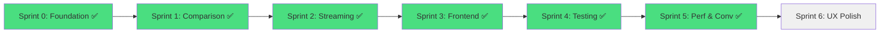

# LLMSelect - Visual Roadmap 🗺️

**Project Timeline:** 16 weeks total | **Current Status:** Phases 1–6 Complete ✅

---

## 📅 Timeline Overview

```
Phase 1: Foundation        ████████████████████ [COMPLETE ✅] Weeks 1-5
Phase 2: Comparison UI     ████████████████████ [COMPLETE ✅] Weeks 6-7
Phase 3: Streaming         ████████████████████ [COMPLETE ✅] Week 8
Phase 4: Frontend Refactor ████████████████████ [COMPLETE ✅] Weeks 9-10
Phase 5: Testing & Azure   ████████████████████ [COMPLETE ✅] Weeks 11-12
Phase 6: Perf & Conv Mgmt  ████████████████████ [COMPLETE ✅] Weeks 13-14
Phase 7: UX Polish         ░░░░░░░░░░░░░░░░░░░ [NOT STARTED] Weeks 15-16
```

**Progress:** ████████████████████░░░░░ ~75%

---

## 🎯 Sprint Plan (Agile 2-Week Sprints)

### 🏁 Sprint 0: Foundation ✅ COMPLETE
**Weeks 1-5** | **Status:** Shipped

**Delivered:**
- ✅ User authentication (JWT + CSRF)
- ✅ API key encryption (Fernet)
- ✅ Backend refactor (service layer, DI container)
- ✅ Database models (User, APIKey, Conversation, Message)
- ✅ Error handling & logging
- ✅ Rate limiting
- ✅ API versioning (`/api/v1`)
- ✅ Health check endpoint

---

### ✅ Sprint 1: Comparison Core — COMPLETE
**Weeks 6-7** | **Status:** Shipped

**Delivered:**
- ✅ ComparisonMode UI with side-by-side layout
- ✅ ModelSelector for 2-4 models (color-coded chips)
- ✅ ResponseCard with metadata (time, tokens)
- ✅ ComparisonResult model + persistence
- ✅ Vote/preference tracking
- ✅ ComparisonHistory with pagination
- ✅ 7 integration tests

---

### ✅ Sprint 2: Streaming — COMPLETE
**Week 8** | **Status:** Shipped

**Delivered:**
- ✅ SSE backend endpoints (`/chat/stream`, `/compare/stream`)
- ✅ Streaming for all 4 providers (OpenAI, Anthropic, Gemini, Mistral)
- ✅ `useStreamingChat` and `useStreamingComparison` hooks
- ✅ Request cancellation (AbortController)
- ✅ Markdown rendering (react-markdown + remark-gfm)
- ✅ Syntax highlighting (277+ languages, VS Code Dark Plus)
- ✅ Code block copy buttons
- ✅ Time to first token < 1 second

---

### ✅ Sprint 3: Frontend Architecture — COMPLETE
**Weeks 9-10** | **Status:** Shipped

**Delivered:**
- ✅ Context API (AuthContext, AppContext, ChatContext)
- ✅ Custom hooks (useModels, useConversations, useToast, useKeyboardShortcuts, etc.)
- ✅ App.js reduced from 377 → 40 lines (89% reduction)
- ✅ Component restructure (19 focused components)
- ✅ `src/contexts/`, `src/pages/` directory structure

---

### ✅ Sprint 4: Testing & Azure — COMPLETE
**Weeks 11-12** | **Status:** Shipped

**Delivered:**
- ✅ Backend test suite (auth, chat, comparisons, models, LLM service)
- ✅ Testing infrastructure documentation
- ✅ Azure AI Foundry integration (optional unified routing)
- ✅ Azure streaming support

---

### ✅ Sprint 5: Performance & Conversations — COMPLETE
**Weeks 13-14** | **Status:** Shipped

**Delivered:**
- ✅ Database indexes (composite indexes for key queries)
- ✅ Connection pooling (SQLAlchemy pool, pre-ping, recycle)
- ✅ Response caching (Flask-Caching, model registry 24h TTL)
- ✅ Eager loading (`joinedload` to prevent N+1)
- ✅ Slow query logging (SQLAlchemy event listeners, >100ms threshold)
- ✅ Performance monitoring middleware (request timing, X-Response-Time headers)
- ✅ Admin endpoints (cache management, detailed health)
- ✅ ConversationSidebar with search
- ✅ Conversation history persistence

---

### ⏸️ Sprint 6: UX Polish — NOT STARTED
**Weeks 15-16** | **Priority:** Medium

**Goals:**
- [ ] Accessibility improvements (ARIA labels, keyboard navigation, WCAG AA)
- [ ] Mobile responsive optimization
- [ ] Dark/light theme toggle
- [ ] Visual polish and animations
- [ ] Loading skeletons for all views

**Definition of Done:**
- [ ] WCAG AA compliant
- [ ] Works on mobile devices
- [ ] Light/dark themes functional
- [ ] Design system documented

---

## 🎯 Critical Path


```mermaid
graph LR
    A[Sprint 0: Foundation ✅] --> B[Sprint 1: Comparison ✅]
    B --> C[Sprint 2: Streaming ✅]
    C --> D[Sprint 3: Frontend ✅]
    D --> E[Sprint 4: Testing ✅]
    E --> F[Sprint 5: Perf & Conv ✅]
    F --> G[Sprint 6: UX Polish]

    style A fill:#4ade80
    style B fill:#4ade80
    style C fill:#4ade80
    style D fill:#4ade80
    style E fill:#4ade80
    style F fill:#4ade80
    style G fill:#f0f0f0
```

**Legend:**
🟢 Green = Complete | ⚪ Gray = Not Started

---

## 🎉 Release Schedule

| Version | Features | Status |
|---------|----------|--------|
| v1.0 | Foundation, Auth, Backend | ✅ Shipped |
| v2.0 | Comparison UI, Streaming, Markdown | ✅ Shipped |
| v2.1 | Azure Integration, Testing Docs | ✅ Shipped |
| v2.2 | Performance, Caching, Conversations | ✅ Shipped |
| v3.0 | UX Polish, Accessibility | 📅 Planned |

---

## 🚦 Risk Management

### Remaining Risks 🟡

**Risk:** Accessibility scope creep
**Impact:** Sprint 6 extends beyond 2 weeks
**Mitigation:** Define clear WCAG AA targets upfront, time-box tasks
**Contingency:** Ship essential accessibility first, iterate

---

## 📈 Success Metrics

### Product Metrics
- Active users
- Comparisons per user per session
- Average session duration

### Technical Metrics
- API response time (p50, p95, p99)
- Error rate (target < 0.5%)
- Cache hit rate (currently >80%)
- Database query time (currently <50ms)

---

## 🚀 Launch Checklist

### Pre-Launch ✅
- ✅ Comparison UI complete
- ✅ Streaming working
- ✅ Frontend refactored
- ✅ Backend test suite passing
- ✅ Performance optimized, caching active

### Post-Launch
- [ ] Gather user feedback
- [ ] UX polish (Sprint 6)
- [ ] Plan advanced features (export, voice, analytics)

---

*Last Updated: February 2026*
*Owner: @jbuz*
